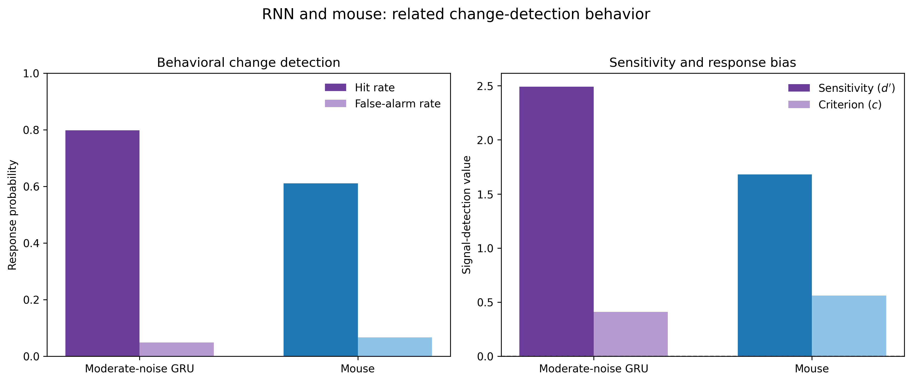
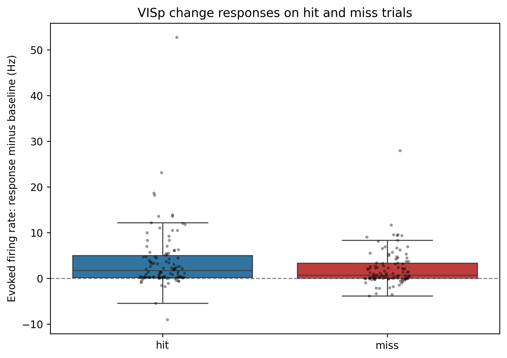
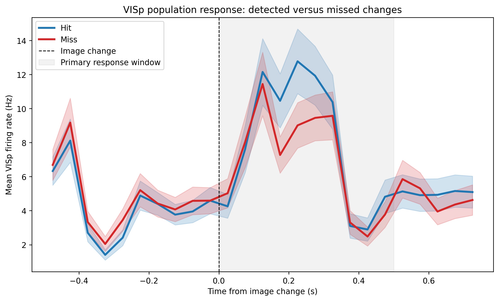
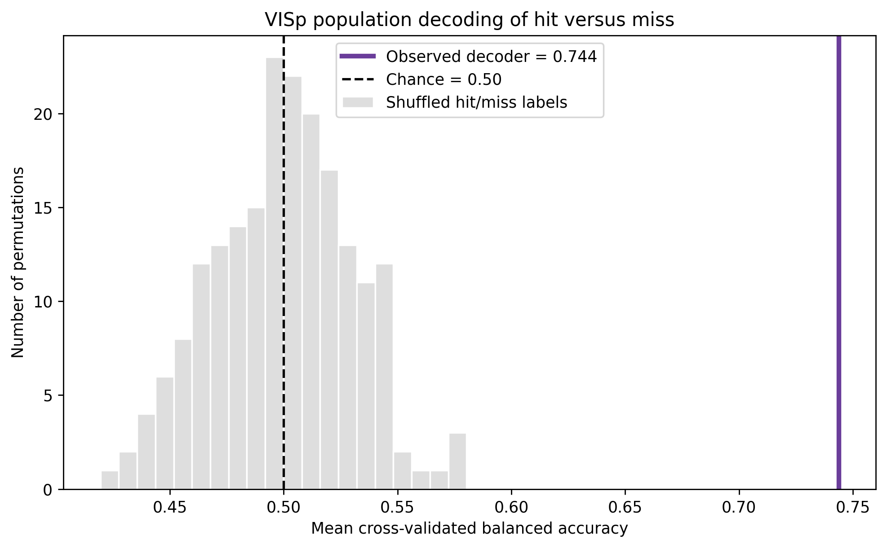

# RNN-Mouse Change Detection

[](https://www.python.org/)
[](LICENSE)

A computational neuroscience project comparing a recurrent neural network (RNN)
with mouse behavior and primary visual cortex (`VISp`) activity during visual
change detection.

## Research question

Can a recurrent neural network maintain a reference stimulus across a delay,
detect a later change, and show behavioral/neural signatures that can be
meaningfully compared with mouse Visual Behavior Neuropixels data?

## Main findings

### Behavioral comparison

| Measure | Moderate-noise GRU | Mouse session 1119946360 |
|---|---:|---:|
| Hit rate | 79.8% | 61.1% |
| False-alarm rate | 4.9% | 6.7% |
| Sensitivity, d' | 2.49 | 1.68 |
| Response criterion, c | 0.41 | 0.56 |

At a threshold adjusted to match the mouse false-alarm rate (6.7%), the RNN
still achieved 81.8% hits. The RNN–mouse performance difference therefore was
not explained only by response bias.

### Mouse VISp neural activity

- Dataset: Allen Institute Visual Behavior Neuropixels
- Session: `1119946360`
- Units: 106 quality-controlled, Allen-labeled `good` VISp units
- Trials: 135 hits and 86 misses
- Mean hit-minus-miss evoked response, 0–500 ms: **+1.60 Hz**
- Paired Wilcoxon test: **p = 2.45e-09**
- Hit-versus-miss population decoding: **74.4% balanced accuracy**
- ROC-AUC: **0.810**
- Permutation test: **p = 0.005** (200 permutations)

## Figures









## Repository structure

```text
notebooks/     Reproducible analysis notebooks
src/           Reusable helper functions
data/derived/  Lightweight derived tables
figures/       Publication-ready figures
results/       Plain-language result summaries
```

## Reproduce

### 1. Create the environment

```bash
conda env create -f environment.yml
conda activate allen_rnn
```

Or install the base requirements:

```bash
pip install -r requirements.txt
```

### 2. Obtain the mouse data

This repository does not include the raw NWB session file.

Download session `1119946360` from the Allen Institute Visual Behavior
Neuropixels dataset using AllenSDK, and update `NWB_PATH` in the mouse-analysis
notebooks.

### 3. Run notebooks in order

1. `01_rnn_change_detection.ipynb`
2. `02_mouse_behavior.ipynb`
3. `03_mouse_visp_neural_activity.ipynb`
4. `04_final_summary.ipynb`

## Important limitations

- The RNN and mouse tasks are related but not identical.
- Mouse neural analyses use one ecephys session; they require replication across
  animals and sessions.
- VISp activity is associated with hit/miss outcome but is not evidence that
  VISp activity alone causally determines the decision.
- Comparing decoder performance does not demonstrate identical RNN and brain
  representational geometry.

## Data attribution

Mouse data come from the Allen Institute Visual Behavior Neuropixels dataset.
Please follow Allen Institute data-use and citation guidance when reusing the
raw data.

## License

This project is released under the [MIT License](LICENSE).
